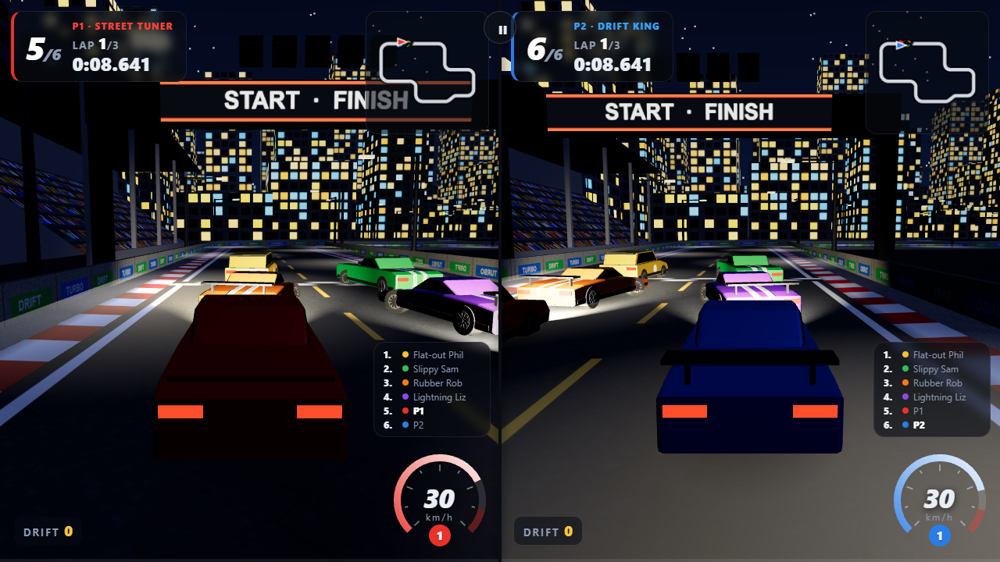

# Drift Game 2

A 3D drift racing game that runs in the browser - no install, no build step.
Race alone against the clock or a ghost car, against up to five bots, or with a
friend on a split screen. Optionally plug in a home-made **ESP32 button
controller**.

**▶ Play it:** https://mateffygabor.github.io/Drift_game/

The interface is available in **English** and **Hungarian** (switch in the top-right corner of the menu).


| Race | Split screen |
|---|---|
|  |  |

## Features

- **3D world** (three.js / WebGL): terrain that the track cuts into, embankments,
  a bridge, dynamic shadows, fog and a different mood per track - green hills,
  a sunset with a Ferris wheel, snowy Alps, a city at night (with working
  headlights and street lights) and a red rock canyon.
- **Drift physics**: automatic 6-speed gearbox, progressive brake, brake + steer
  to start a drift, gas + steer to hold it, countersteer to catch it. Drift
  points with a combo multiplier.
- **3 game modes**: Practice (leaderboard + ghost car), 1 player vs 1-5 bots,
  2 players on a split screen + 0-4 bots.
- **7 vehicles** with different stats (from a go-kart to an off-road pickup) and
  8 colours each; **5 tracks** from easy to hard.
- **Ghost car** that replays your best lap, saved per track.
- **Synthesised sound** (Web Audio): engine with gear changes, tyre squeal,
  impacts, stereo split for two players. No audio files.
- **Optional ESP32 controller** with 8 buttons (4 per player) over USB or WiFi.
- Works **offline**: everything (including three.js) is in the repository;
  textures and sounds are generated at runtime.

## Quick start

| Where | How |
|---|---|
| Online | Open the GitHub Pages link above in Chrome, Edge or Firefox. |
| Windows | Double-click **`start.bat`** - it starts a local server on port 8002 and opens `http://localhost:8002`. Keep the server window open while playing. |
| Any OS | Run `python -m http.server 8002` in this folder, then open `http://localhost:8002`. |

Opening `index.html` directly from disk (`file://`) does **not** work -
browsers don't load JavaScript modules from files, so a web server is needed.

## Controls

| Action | Player 1 | Player 2 |
|---|---|---|
| Gas | `↑` | `W` |
| Brake / reverse | `↓` | `S` |
| Steer | `←` `→` | `A` `D` |
| Pause | `Esc` or `P` | |
| Change camera | `C` | |

**Drifting:** at speed, brake and steer at the same time, then hold the slide
with gas and steering. Steer the other way (countersteer) to regain grip.

## Documentation

- [User guide](docs/USER_GUIDE.md) - game modes, vehicles, tracks, settings, troubleshooting
- [Building the ESP32 controller](docs/CONTROLLER_BUILD.md) - parts, wiring, flashing, connecting
- [Developer guide](docs/DEVELOPER_GUIDE.md) - architecture, adding tracks/vehicles/languages, testing, deployment, security notes

## Project structure

```
index.html          menu, garage and race screens
css/style.css       styling
lib/three.module.js three.js r170 (3D engine, vendored)
src/                game code (plain JavaScript ES modules, no build step)
esp32/              ESP32 controller firmware (USB, WiFi access point, home WiFi)
docs/               documentation and diagrams
tools/smoke_test.py headless browser test
start.bat           local web server for Windows (port 8002)
```

## Credits

- 3D engine: [three.js](https://threejs.org/) (MIT licence), included as `lib/three.module.js`.
- Everything else - models, textures, sounds - is generated by the game's own code.

## License

[MIT](LICENSE) - feel free to use, modify and share it. three.js keeps its own MIT licence (see the header of `lib/three.module.js`).
