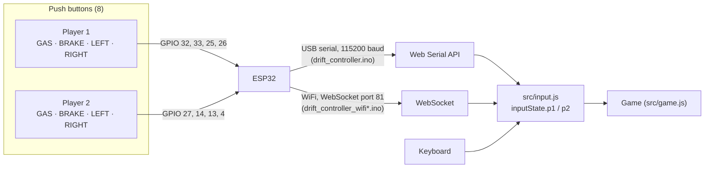
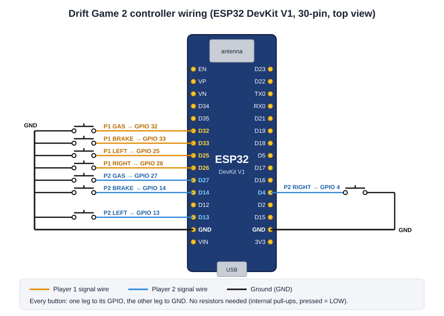
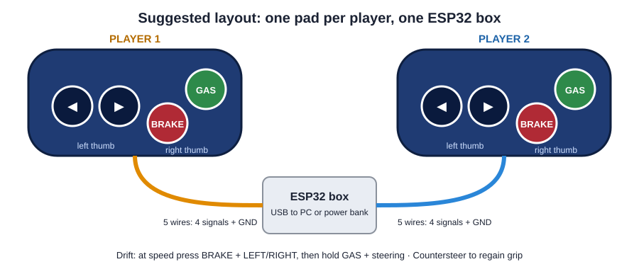
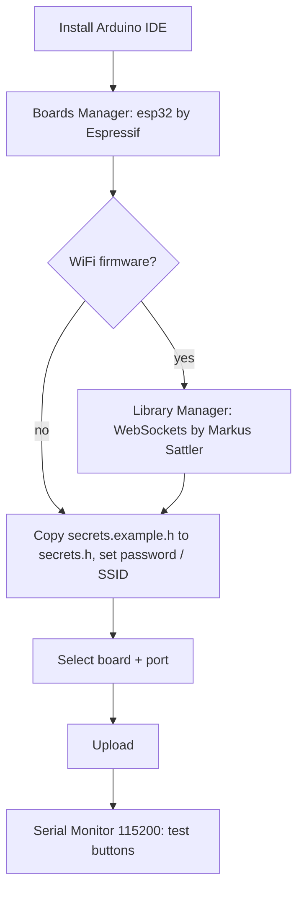

# Building the ESP32 controller

The Drift Game 2 controller is eight push buttons (four per player) connected
to an ESP32 board. The ESP32 reads the buttons and streams their state to the
game ~50 times per second, either over the **USB cable** or over **WiFi**.

The controller is optional – the game is fully playable with the keyboard.

- [How it works](#how-it-works)
- [Parts list](#parts-list)
- [Which firmware?](#which-firmware)
- [Wiring](#wiring)
- [Physical layout](#physical-layout)
- [Flashing the firmware](#flashing-the-firmware)
- [Testing the buttons](#testing-the-buttons)
- [Connecting to the game](#connecting-to-the-game)
- [Playing with the controller](#playing-with-the-controller)
- [Troubleshooting](#troubleshooting)
- [Protocol reference](#protocol-reference)

## How it works



Every 20 ms the ESP32 sends one line of text with eight 0/1 values:

```
G1,B1,L1,R1,G2,B2,L2,R2      e.g.  1,0,0,1,0,0,1,0
```

The game merges it with the keyboard (either one can be used at any time).

## Parts list

| Qty | Part | Notes |
|---|---|---|
| 1 | **ESP32 development board** | ESP32 DevKit V1 (30-pin, ESP-WROOM-32) is what the diagrams show. Any classic ESP32 board exposing GPIO 4, 13, 14, 25, 26, 27, 32, 33 works. *Not* ESP32-S2/S3/C3 without changing pins. |
| 8 | **Momentary push buttons** (normally open) | Arcade buttons (24/30 mm) feel best; 12 mm tactile switches are fine for a prototype. Only 4 are needed for a single player. |
| 1 | **USB data cable** for the board | Micro-USB or USB-C depending on the board – a *data* cable, not charge-only. |
| ~3 m | Hook-up wire (22–26 AWG) or jumper wires | Two colours help: one for signals, black for GND. |
| optional | Breadboard / perfboard, screw terminals, heat-shrink | |
| optional | Enclosures for the two pads and the ESP32 | 3D-printed, plywood, or a food container. |
| optional | USB power bank | For the WiFi version, so no cable to the PC is needed. |

No resistors, capacitors or other components are required: the ESP32's
internal pull-up resistors are used and the firmware debounces the buttons in
software.

Tools: a computer with the **Arduino IDE 2.x**, a soldering iron (or a
breadboard for a solder-free prototype), wire strippers.

## Which firmware?

All three sketches use **the same wiring**. Pick one:

| Firmware | Folder | Link to the game | Use it when |
|---|---|---|---|
| **USB** | `esp32/drift_controller/` | USB cable, Web Serial | Playing on **GitHub Pages** (HTTPS), or you want zero setup. Needs Chrome or Edge on a desktop. |
| **WiFi access point** (recommended for WiFi) | `esp32/drift_controller_wifi_ap/` | ESP32 creates its own WiFi `DriftController`, address `192.168.4.1` | Running the game **locally** (`start.bat`) and you want no cable. |
| **WiFi home network** | `esp32/drift_controller_wifi/` | ESP32 joins your router's WiFi | Running locally and the PC must stay on the normal network / internet. |

> **Why WiFi doesn't work on GitHub Pages:** GitHub Pages is served over
> `https://`. The ESP32 speaks plain `ws://` (it can't hold a TLS certificate
> for a local IP), and browsers block unencrypted connections from secure
> pages ("mixed content"). The game shows a message about this in the
> Controller panel. Options:
> 1. Use the **USB firmware** (Web Serial works fine on HTTPS), or
> 2. Run the game **locally** with `start.bat` (`http://localhost:8002`), where WiFi works.

## Wiring

Each button has two legs: **one goes to its GPIO pin, the other to GND**.
All GND legs can share one wire (a GND "bus").



| Player | Button | GPIO | DevKit V1 label | Header side |
|---|---|---|---|---|
| 1 | GAS | 32 | D32 | left |
| 1 | BRAKE | 33 | D33 | left |
| 1 | LEFT | 25 | D25 | left |
| 1 | RIGHT | 26 | D26 | left |
| 2 | GAS | 27 | D27 | left |
| 2 | BRAKE | 14 | D14 | left |
| 2 | LEFT | 13 | D13 | left |
| 2 | RIGHT | 4 | D4 | right |
| both | other leg of every button | GND | GND | either |

Playing alone? Wire only player 1's four buttons – unconnected inputs read as
"not pressed".

The electrical principle for one button:

```
 ESP32 3.3 V ──[internal pull-up ~45 kΩ]──┬── GPIO pin
                                           │
                                         [button]
                                           │
                                          GND
 released: pin reads HIGH (1) → firmware reports 0
 pressed:  pin reads LOW  (0) → firmware reports 1
```

### Why these pins?

The default pins avoid the ESP32's problem pins. If you change pins in the
sketch (`PIN_*` constants), keep to the same rules:

| Avoid | Reason |
|---|---|
| GPIO 34, 35, 36 (VP), 39 (VN) | Input-only **without internal pull-ups** – a button would float. |
| GPIO 0, 2, 5, 12, 15 | Strapping pins: a pressed button at power-up can stop the board from booting or change the flash voltage (GPIO 12!). |
| GPIO 6–11 | Connected to the on-board flash. |
| GPIO 1, 3 (TX0/RX0) | The USB serial link – needed by the USB firmware. |

If you change a pin, change it in **all** sketches you use; the game itself
doesn't care which pins are used.

## Physical layout



A layout that works well: LEFT/RIGHT under the left thumb, BRAKE/GAS under the
right thumb, with BRAKE and the steering buttons easy to press **together** –
that's how a drift is started.

Build tips:

- Use a 5-core cable (4 signals + GND) or a ribbon cable from each pad to the ESP32 box.
- Label the wires before soldering; mixing up two signals is the most common mistake (fix it by swapping wires *or* by swapping the `PIN_*` numbers).
- Strain-relieve the cables (cable tie or hot glue) so a yank doesn't pull the solder joints.
- Leave the ESP32's USB port reachable for flashing and power.

## Flashing the firmware

1. Install the **Arduino IDE** (2.x) from arduino.cc.
2. Add ESP32 support: **Tools → Board → Boards Manager…**, search **esp32**,
   install **"esp32" by Espressif Systems**.
3. *(WiFi versions only)* Install the WebSocket library: **Sketch → Include
   Library → Manage Libraries…**, search **WebSockets**, install the one by
   **Markus Sattler (links2004)**.
4. Open the sketch, e.g. `esp32/drift_controller_wifi_ap/drift_controller_wifi_ap.ino`.
5. *(WiFi versions only)* In the sketch's folder, copy `secrets.example.h` to
   **`secrets.h`** and edit the copy. `secrets.h` is git-ignored, so your
   password never ends up in the repository.
   - **WiFi AP version:** choose your own `AP_PASSWORD` (8–63 characters). Anyone who knows it can join the controller's network.
   - **Home WiFi version:** put your network name and password into `WIFI_SSID` / `WIFI_PASSWORD`.

   The values in the template are commented out (`//`) – remove the `//` after
   filling them in. The sketch refuses to compile while `secrets.h` is missing
   or the values aren't set.
6. Plug in the ESP32, select **Tools → Board → ESP32 Dev Module** (or your board) and the right **Port**.
7. Click **Upload**. If it hangs at `Connecting....`, hold the board's **BOOT** button until the upload starts.



## Testing the buttons

Open **Tools → Serial Monitor** at **115200 baud**.

- **USB firmware:** you see a stream of lines such as `0,0,0,0,0,0,0,0`.
  Press P1 GAS and the first value becomes `1`.
- **WiFi firmware:** the network / IP address is printed at start-up, then every 0.3 s:
  ```
  P1: GAS=0 BRAKE=0 LEFT=0 RIGHT=0 | P2: GAS=0 BRAKE=0 LEFT=0 RIGHT=0 | clients: 0
  ```
  Press each button and check that the right value changes.

**Close the Serial Monitor before connecting the game over USB** – only one
program can use the serial port at a time.

## Connecting to the game

### USB (works locally and on GitHub Pages)

1. Use **Chrome** or **Edge** on a desktop (Web Serial isn't available in Firefox / Safari).
2. Plug in the controller (USB firmware) and close the Arduino Serial Monitor.
3. Menu → **Controller** → **Connect controller (USB serial)** → pick the board's port.
4. The status turns **connected**. The browser remembers the permission and
   reconnects automatically on the next visit and after unplugging / replugging.

On connect the game restarts the ESP32 into normal run mode (like the Arduino
IDE does), because some boards get stuck in bootloader mode when the port is
opened.

### WiFi access point (local game only)

1. Power the controller (USB or power bank).
2. Join the WiFi network **DriftController** with your computer (Windows may say "No internet" – that's expected).
3. Start the game locally (`start.bat`), menu → **Controller**, enter
   **`192.168.4.1`** → **Connect via WiFi**.

### WiFi home network (local game only)

1. Read the ESP32's IP address from the Serial Monitor (e.g. `192.168.1.42`).
2. Enter it (or `driftcontroller.local`) → **Connect via WiFi**.

Only a plain IP address or host name is accepted (a `ws://` prefix or `:81`
suffix is stripped). The WiFi link reconnects by itself if it drops. During a
race a lost connection pauses the game; press GAS to continue once it's back.

## Playing with the controller

| Action | Buttons |
|---|---|
| Accelerate / brake / steer | GAS / BRAKE / LEFT / RIGHT |
| Start a drift | at speed, BRAKE + LEFT or RIGHT |
| Hold the drift | GAS + steering into the corner |
| Catch the drift | steer the other way (countersteer) |
| Garage | LEFT / RIGHT change vehicle, GAS ready, BRAKE cancel |
| Pause screen | GAS (player 1) resumes |
| Results screen | GAS (player 1) races again, BRAKE returns to the menu |

## Troubleshooting

| Symptom | Likely cause / fix |
|---|---|
| USB status: **port is busy** | Close the Arduino Serial Monitor or another tab using the port. |
| USB status: **no data** | Wrong firmware (a WiFi sketch is flashed), or a charge-only cable. Flash `drift_controller.ino`. |
| USB button says **not supported** | Web Serial is Chrome / Edge on a desktop only. |
| WiFi status: **browsers block the WiFi link from an HTTPS page** | Expected on GitHub Pages – see [Which firmware?](#which-firmware). Use USB or run locally. |
| WiFi status: **invalid address** | Enter only an IP address or host name, e.g. `192.168.4.1`. |
| WiFi connects, then **reconnecting…** loops | Weak signal or power – use a better USB power source; move closer. On Windows, turn off *Connect automatically* for other known networks while playing (it may switch away from the "no internet" controller network). |
| WiFi home version prints dots forever | Wrong SSID/password, or a 5 GHz-only network (the ESP32 needs 2.4 GHz). |
| A button is **always pressed** | Its wire touches GND, or it's a normally-closed button. Check in the Serial Monitor. |
| A button **does nothing** | Broken solder joint, or wired to the wrong pin. Check the Serial Monitor; compare with the wiring table. |
| Two buttons **swapped** | Swap the wires or the `PIN_*` numbers in the sketch. |
| Board **won't boot** with the pads connected | A button is on a strapping pin (0, 2, 5, 12, 15) – use the default pins. |
| Upload stuck at `Connecting....` | Hold BOOT during upload; try another cable / port. |

The browser console (F12) logs every connection change with the prefixes
`[USB controller]` and `[WiFi controller]`.

## Protocol reference

Use this if you want to build a different controller (another microcontroller,
a phone app, a gamepad bridge…). The game accepts exactly this format:

- **Line format:** `G1,B1,L1,R1,G2,B2,L2,R2` – eight values, each `0` or `1`,
  comma-separated. Anything else is ignored.
- **USB:** 115200 baud, lines terminated by `\n`. On connect the game toggles
  DTR/RTS to reset an ESP32 into run mode (harmless for other boards).
- **WiFi:** a WebSocket server at `ws://<host>:81/`; each text message is one
  line (no newline needed). The game never sends anything back.
- **Rate:** about every 20 ms. If nothing arrives for 0.4 s the game releases
  all buttons; after 2 s it reopens the WiFi connection.
- Keep sending even when nothing changes – the regular stream is the "I'm alive" signal.
