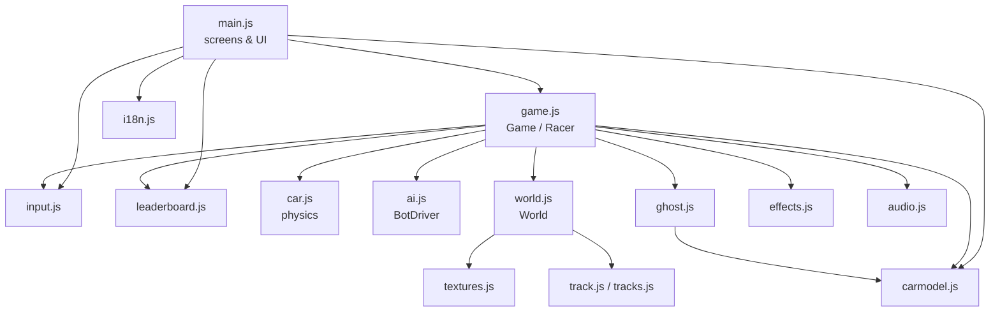
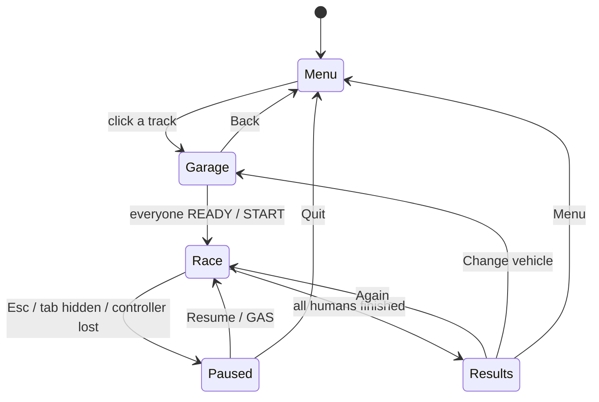
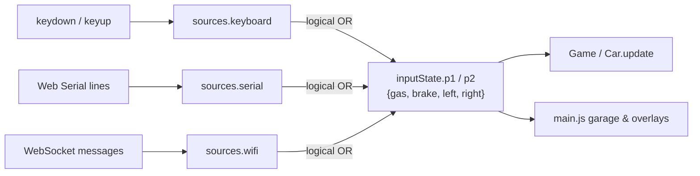

# Drift Game 2 – Developer guide

- [Tech stack](#tech-stack)
- [Running and debugging](#running-and-debugging)
- [Project structure](#project-structure)
- [Architecture](#architecture)
- [The frame loop](#the-frame-loop)
- [Coordinates and units](#coordinates-and-units)
- [Input pipeline](#input-pipeline)
- [Translations (i18n)](#translations-i18n)
- [How to add things](#how-to-add-things)
- [Tuning](#tuning)
- [Saved data (localStorage)](#saved-data-localstorage)
- [Security notes](#security-notes)
- [Testing](#testing)
- [Deployment (GitHub Pages)](#deployment-github-pages)
- [Known limitations](#known-limitations)

## Tech stack

- **Plain JavaScript ES modules** – no framework, no bundler, no `npm install`.
  The repository *is* the website.
- **three.js r170**, vendored as `lib/three.module.js`.
- **Canvas 2D** for every texture and HUD gauge (no image assets).
- **Web Audio API** – all sounds are synthesised (`src/audio.js`).
- **Web Serial API** and **WebSocket** for the ESP32 controller (`src/input.js`).
- **Arduino (C++)** firmware in `esp32/`.

## Running and debugging

```bash
python -m http.server 8002      # or start.bat on Windows
# open http://localhost:8002
```

ES modules don't load from `file://`, so always use a web server. There is no
build step: edit a file, reload the page.

A debug handle is exposed on `window.__drift`:

```js
__drift.game.state                  // 'idle' | 'countdown' | 'racing' | 'paused' | 'raceOver'
__drift.game.humans[0].car          // player 1's car (position, speed, gear, ...)
__drift.setMode('solo')             // 'practice' | 'solo' | 'duo'
__drift.openGarage('mountain')      // jump to the garage of a track (ids: __drift.TRACKS)
__drift.startRace()                 // start with the current garage selection
__drift.setLanguage('en')           // 'hu' | 'en'
```

Controller links log their state changes to the console with the prefixes
`[USB controller]` and `[WiFi controller]`.

## Project structure

| File | Responsibility |
|---|---|
| `index.html` | Static markup of the three screens (menu, garage, race) and the overlays. Texts come from `data-i18n*` attributes. Contains the Content-Security-Policy. |
| `css/style.css` | All styling. |
| `src/main.js` | Entry point. Menu, garage with the 3D preview (`CarPreview`), settings, pause / results overlays, controller connection UI, language switch. |
| `src/game.js` | `Game` and `Racer`: loads a track, creates the racers, runs the frame loop, cameras, split screen, HUD, laps, collisions, drift points. |
| `src/car.js` | `Car`: 2D physics (gearbox, progressive brake, drift, grip). `CAR_TUNING`, `carSettings`. |
| `src/ai.js` | `BotDriver` (presses the same 4 buttons as a human), the racing line, `BOT_LEVELS`. |
| `src/ghost.js` | `Ghost`: records the owner's laps, replays the best one, saves it per track. |
| `src/input.js` | Keyboard + USB serial + WiFi controller merged into `inputState.p1/p2`. |
| `src/vehicles.js` | `VEHICLES` (stats, dimensions, engine sound), `CAR_COLORS`, `statBars`. |
| `src/tracks.js` / `src/track.js` | Track definitions / geometry (fillets, resampling, nearest-point queries, grid). |
| `src/world.js` | The 3D world of a track: themes, terrain, road, walls, bridge, start area, scenery, lights. |
| `src/carmodel.js` | Procedural low-poly 3D cars and the floating name tags. |
| `src/effects.js` | Skid marks and particles (smoke, dust, sparks). |
| `src/textures.js` | Canvas-generated textures. |
| `src/audio.js` | Engine sounds and sound effects. |
| `src/leaderboard.js` | Practice-mode top 10 per track (localStorage), `formatTime`. |
| `src/i18n.js` | Every UI string in Hungarian and English; `t()`, language switching. |
| `esp32/*/` | Controller firmware: USB, WiFi access point, WiFi home network. |
| `tools/smoke_test.py` | Headless browser smoke test. |

## Architecture



Screen flow:



## The frame loop

`Game._frame()` runs on `requestAnimationFrame` (`dt` capped at 50 ms):

1. **Countdown** (`_updateCountdown`) – start lights, engines can be revved.
2. **Physics** (`_updatePhysics`), per racer: input (human `inputState` or
   `BotDriver.update`) → `Car.update` → nearest track index → wall collision →
   off-track test → checkpoints / laps → drift points → wrong-way detection →
   engine sound → particles. Then car-to-car collisions and race positions.
3. **Ghost** – record the owner's position, move the replay car.
4. **Visuals** – car transforms (body roll, pitch, wheels), effects, world animation.
5. **Cameras and rendering** – one viewport per human (scissor test on one canvas).
6. **HUD** (`_updateHud`) – DOM updates are cached (`_setText`) to avoid layout thrash.

Lap counting uses 24 checkpoints spread along the centreline; a lap only
counts when every checkpoint was entered in order, so shortcuts and driving
backwards over the line don't count. Lap times use `performance.now()`; the
pause time is added back on resume.

## Coordinates and units

- **Physics** is 2D: `(x, y)` in *units*, **10 units = 1 m**.
- **3D** position is `(x * S, h * S, y * S)` with `S = 0.1` (`world.js`); `h` is the track height.
- A car's heading `angle` is in radians in the physics plane; the 3D model uses `rotation.y = -angle`.
- Car model local axes: **+X forward, +Y up, +Z right** (metres).
- The track centreline is an evenly spaced point list (`track.centerline`,
  spacing `track.step` ≈ 13 units) with tangent `(tx, ty)`, normal `(nx, ny)`
  pointing to the right, height `h` and a `bridge` flag.

## Input pipeline



- Each source has its own state; the result is OR-ed, so one source never clears another.
- Controller lines must be exactly eight comma-separated `0`/`1` values; anything else is ignored.
- A watchdog releases the controller buttons after 0.4 s without data; after
  2 s the WiFi link is reopened.
- The protocol is described in [CONTROLLER_BUILD.md](CONTROLLER_BUILD.md#protocol-reference).

## Translations (i18n)

All UI text is in `src/i18n.js` (`STRINGS.hu` / `STRINGS.en`).

- In code: `t('msg.lap', { time: '1:02.345' })` → `"Lap: 1:02.345"`.
- In HTML: `data-i18n="key"` (text), `data-i18n-html="key"` (markup we write
  ourselves – never user input), `data-i18n-placeholder`, `data-i18n-title`.
- Data objects expose translated getters: `vehicle.name` / `.desc`,
  `track.name` / `.description` / `.difficultyLabel`, `CAR_COLORS[i].name`.
- `setLanguage()` re-applies the static texts and calls the
  `onLanguageChange()` listeners (main.js re-renders the menu and garage). The
  in-race HUD and the 3D banners are built when a race loads, so they follow
  the language chosen in the menu.
- On the first visit the language follows the browser (`hu*` → Hungarian,
  anything else → English); after that the choice is saved.
- A missing key falls back to Hungarian, then to the key itself.
- Don't name a local variable `t` in a function that calls `t()` – it shadows
  the translation function.

**Adding a language:** copy the `en` block to a new code (e.g. `de`), translate
it, add the code to `LANGUAGES` and `LOCALES`, and add a button to
`#setting-lang` in `index.html`. Every language block should contain the same
keys.

## How to add things

### A vehicle

1. Add an object to `VEHICLES` in `src/vehicles.js` (`id`, `model`, `dims`,
   `stats`, `engine`).
2. `model` must be a key of `MODELS` in `src/carmodel.js` (or `'kart'`).
   A new model is a side profile (`body`, `cabin` point lists) plus wheel and
   light positions – copy an existing one.
3. Add `vehicle.<id>.name` and `vehicle.<id>.desc` to every language in `src/i18n.js`.

### A track

1. Add a `new Track({...})` entry to `TRACKS` in `src/tracks.js`: `id`,
   `difficulty` (`easy`/`medium`/`hard`), `theme` (key of `THEMES` in
   `world.js`), `roadWidth`, `runoffWidth`, optional `bridgeHeight`, and
   `verts` (`[x, y, height, cornerRadius]`, vertex 0 = start line on a straight).
2. Keep every corner radius larger than `roadWidth / 2 + runoffWidth`, and
   keep different parts of the track more than two wall widths apart (except
   at a bridge).
3. Add `track.<id>.name` and `track.<id>.desc` to every language (and
   `theme.<theme>` if you add a theme).

## Tuning

- Car physics: `src/car.js` – `CAR_TUNING` (gearbox: `gearTops`, `gearTorque`,
  `shiftTime`; brake: `brakeMax`, `brakeStart`, `brakeRamp`; drift:
  `driftGripLoss`, `maxSlipAngle`, `driftTransfer`).
- Bots: `src/ai.js` – `BOT_LEVELS`.
- Vehicles: `src/vehicles.js` – `stats`.
- Cameras: `src/game.js` – `CAMERA_MODES`.
- Graphics presets: `src/world.js` – `QUALITY`.

## Saved data (localStorage)

| Key | Content |
|---|---|
| `driftgame2_lang` | `hu` / `en` |
| `driftgame2_mode`, `driftgame2_laps`, `driftgame2_botlevel`, `driftgame2_botcounts`, `driftgame2_ghostchoice` | menu / garage choices |
| `driftgame2_speed`, `driftgame2_sens2`, `driftgame2_drift`, `driftgame2_vol`, `driftgame2_volume` | sliders (the volume is stored as a percentage by the menu and as 0–1 by the audio engine) |
| `driftgame2_camera`, `driftgame2_quality`, `driftgame2_swap` | display settings |
| `driftgame2_selections` | last picked vehicles and colours |
| `driftgame2_leaderboard` | Practice top 10 per track |
| `driftgame2_ghost_<trackId>` | best ghost lap per track |
| `driftgame_last_name` | player name |
| `driftgame_last_controller_host` | last WiFi controller address |
| `driftgame2_serial_auto` | USB vendor/product id for automatic reconnect |

Everything read back from storage is validated (unknown values fall back to
the defaults), so a hand-edited or corrupted entry can't break the game.

## Security notes

The game is a static site with no backend, no accounts and no network calls
except the optional controller link. Results of the review:

| Area | Status |
|---|---|
| **HTML injection** | User-controlled text (player name, leaderboard entries, bot/vehicle names) is inserted with `textContent` or escaped before going into `innerHTML`. `data-i18n-html` is only used for strings we write ourselves. |
| **Content-Security-Policy** | `index.html` allows only same-origin scripts (no inline scripts, no `eval`), images from self/`data:`/`blob:`, and connections to self plus `ws:`/`wss:` for the controller. Inline *styles* are allowed (the HUD sets CSS variables). |
| **localStorage tampering** | Settings, bot counts, selections, volume, the leaderboard and ghost laps are validated. Previously an invalid laps value made a race never end (`NaN`) and an invalid colour index crashed the garage. |
| **Controller host** | The WiFi address is validated as a plain host name / IPv4 before building `ws://<host>:81/`, so it can't inject a path, port or scheme. |
| **Controller data** | Only lines of exactly eight `0`/`1` values are accepted. |
| **Mixed content** | Browsers block `ws://` from an HTTPS page (GitHub Pages). The game detects this and shows a message instead of retrying forever; USB works there. |
| **Local server** | `start.bat` binds the Python server to `127.0.0.1`, so the project folder isn't served to the whole network (previously it listened on every interface). |
| **Firmware – WiFi AP** | The default AP password `drift1234` is public in this repository: change `AP_PASSWORD` before using the controller in public. The WebSocket server has no authentication – anyone on the controller's network can read the (harmless) button stream. |
| **Firmware – home WiFi** | Your network credentials are compiled into the sketch – never commit real ones. |
| **Third-party code** | three.js is vendored (no CDN), so the site loads nothing from other origins. |

## Testing

```bash
node --check src/game.js              # syntax check (any module)
pip install playwright                # once; the test uses your installed Chrome
python tools/smoke_test.py            # headless end-to-end smoke test
```

The smoke test starts a local server and, in headless Chrome, switches
languages, feeds corrupted localStorage values, checks the WiFi address
validation, starts a Practice race on every track and a race against bots,
and finishes it to check the results screen. It fails on any JavaScript
error. Headless Chrome renders WebGL in software, so it takes a minute or two.
Because the page's CSP forbids `eval`, the test polls with `page.evaluate`
instead of `page.wait_for_function`.

The firmware has no automated tests – use the Serial Monitor output described
in [CONTROLLER_BUILD.md](CONTROLLER_BUILD.md#testing-the-buttons).

## Deployment (GitHub Pages)

1. Push the repository to GitHub (the game files must be in the repository root).
2. **Settings → Pages → Build and deployment → Source: Deploy from a branch**,
   branch `main`, folder `/ (root)`.
3. After a minute the game is live at `https://<user>.github.io/<repository>/`.
   Put that link into the README.

`.nojekyll` disables Jekyll processing, so every file is served as-is. All
paths in the code are relative, so the game works from a sub-path.
On the HTTPS site only the **USB** controller works (see
[Security notes](#security-notes)).

## Known limitations

- The leaderboard and ghost laps are per browser; there is no online leaderboard.
- The WiFi controller can't be used from the HTTPS site.
- Web Serial (USB controller) requires Chrome or Edge on a desktop.
- There are no touch controls – a keyboard or the controller is needed.
- Three WebGL contexts can exist at once (game + two garage previews); very old
  GPUs/browsers with a low context limit may struggle.
