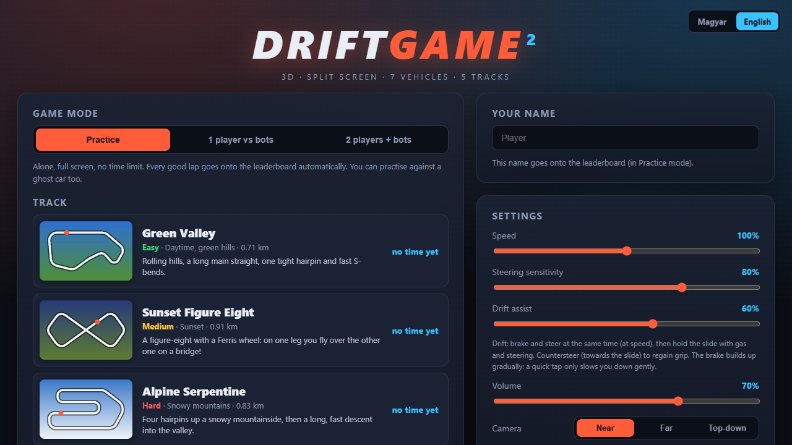
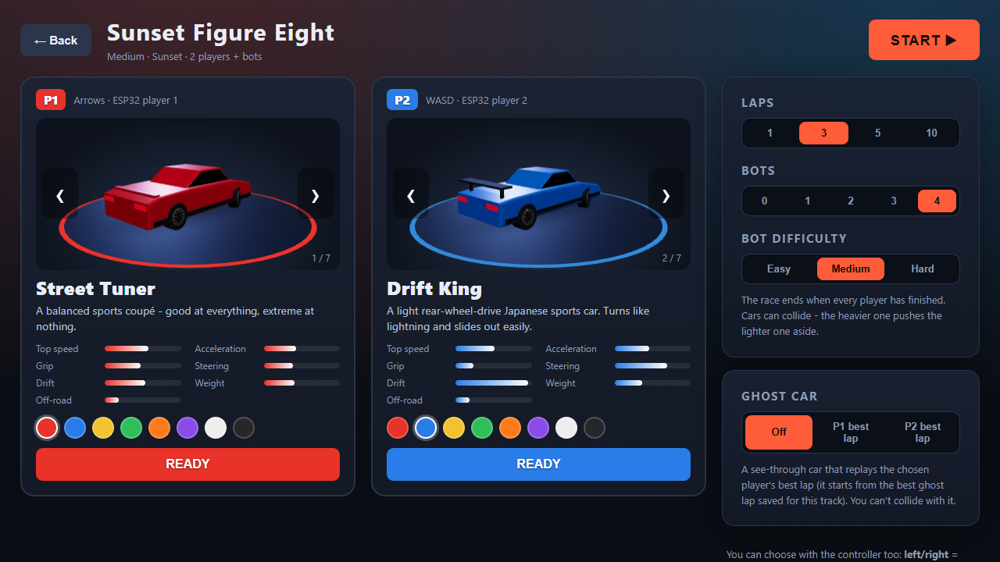
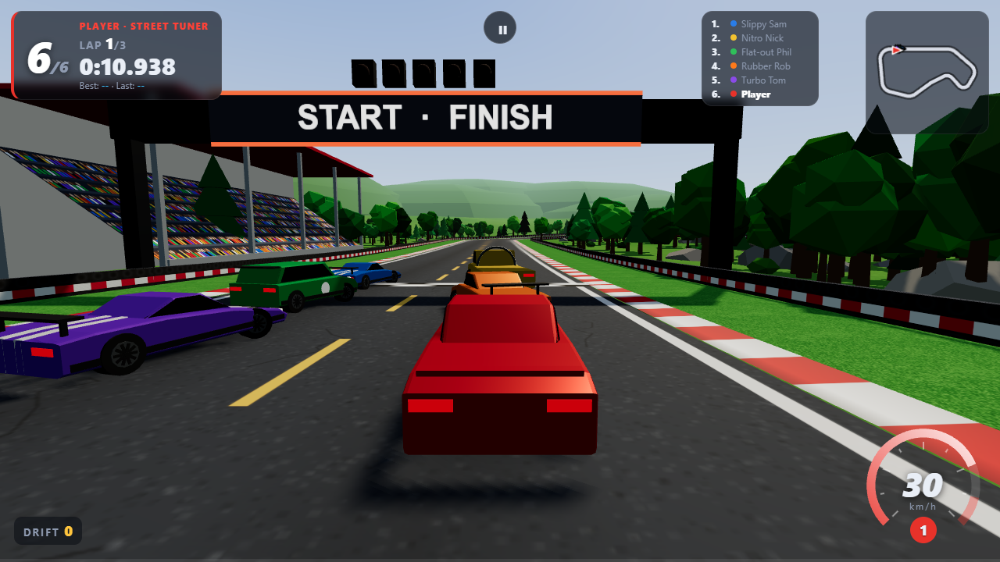

# Drift Game 2 – User guide

- [Starting the game](#starting-the-game)
- [Menu and language](#menu-and-language)
- [Game modes](#game-modes)
- [Choosing a vehicle (garage)](#choosing-a-vehicle-garage)
- [Controls](#controls)
- [Driving and drifting](#driving-and-drifting)
- [The race screen](#the-race-screen)
- [Vehicles](#vehicles)
- [Tracks](#tracks)
- [Settings](#settings)
- [Saved data](#saved-data)
- [Troubleshooting](#troubleshooting)

## Starting the game

| Where | How |
|---|---|
| Online | Open the GitHub Pages link from the [README](../README.md) in **Chrome**, **Edge** or **Firefox**. |
| Windows, local | Double-click **`start.bat`**. A console window with the web server opens (keep it open while playing) and the browser opens `http://localhost:8002`. |
| Any OS, local | Run `python -m http.server 8002` in the game folder and open `http://localhost:8002`. |

Requirements: a browser with WebGL and a keyboard (or the
[ESP32 controller](CONTROLLER_BUILD.md)). A dedicated graphics card is not
required – lower the **Graphics** setting on slow machines. The game needs no
internet connection once it is loaded locally.

## Menu and language

- **Magyar / English** (top right) switches the language of the whole
  interface. The choice is remembered; on the first visit the game follows
  your browser's language.
- **Game mode** – see below.
- **Track** – click a track card to go to the garage. The card shows the
  difficulty, the scenery, the length and your best Practice lap.
- **Your name** – used on the Practice leaderboard (max. 12 characters).
- **Settings** – see [Settings](#settings).
- **Controller** – connect the DIY ESP32 controller over WiFi or USB
  (see [CONTROLLER_BUILD.md](CONTROLLER_BUILD.md)).

## Game modes

| Mode | Players | Description |
|---|---|---|
| **Practice** | 1 | Alone, full screen, no time limit. Every good lap goes onto the per-track **top-10 leaderboard**. A ghost car is on by default. |
| **1 player vs bots** | 1 + 1–5 bots | A real race. You start from the back of the grid. |
| **2 players + bots** | 2 + 0–4 bots | Split screen (left / right, swappable in Settings). |

In the race modes you choose **1, 3, 5 or 10 laps**. The race ends when every
human player has crossed the finish line; a player who has finished is driven
on by the computer on a cool-down lap. The **results screen** shows everyone's
position, finishing time, best lap and drift points.

### Bots

Bots press the same four "buttons" as you and are moved by the same physics –
they follow a racing line, brake before corners and steer around cars in front
of them. Difficulty: **Easy / Medium / Hard** (cornering speed and engine
power). On the grid the bots start in front and the players at the back.

### Ghost car

A see-through car that replays the best lap of the chosen player (**P1** or
**P2**). The best ghost lap of every track is saved in your browser, so it is
there in the next session too. After every lap the message shows how much
faster (`-0.42 s`) or slower (`+1.10 s`) you were. You can't collide with it.

## Choosing a vehicle (garage)

- Click **‹ ›** to change the vehicle, click a colour swatch to repaint it.
- Press **READY** (or **START** at the top right). The race starts when every
  player is ready.
- With the keyboard or controller: **left/right** = change vehicle, **gas** =
  ready, **brake** = cancel.
- On the right: laps, number of bots and bot difficulty (race modes), the ghost
  car, and the leaderboard (Practice).

## Controls

### Keyboard

| Action | Player 1 | Player 2 |
|---|---|---|
| Gas | `↑` | `W` |
| Brake / reverse | `↓` | `S` |
| Steer | `←` `→` | `A` `D` |

| Anywhere in a race | |
|---|---|
| `Esc` or `P` | pause / resume |
| `C` | cycle camera: near → far → top-down |

The game also pauses by itself when you switch to another tab or window.

### ESP32 controller

Each player has four buttons – **GAS**, **BRAKE**, **LEFT**, **RIGHT** – that
work exactly like the keys above. Keyboard and controller work at the same
time; neither overrides the other.

| Screen | Buttons |
|---|---|
| Garage | LEFT / RIGHT = change vehicle, GAS = ready, BRAKE = cancel |
| Pause screen | GAS (player 1) = resume |
| Results screen | GAS (player 1) = race again, BRAKE = back to the menu |

If the controller loses its connection during a race, the game **pauses
automatically** and shows the status at the top of the screen. When the link
is back, release and press GAS to continue.

## Driving and drifting

- **Gearbox:** automatic, 6 gears. Low gears pull harder; on every upshift the
  drive is cut for a moment. The arc of the speedometer shows the engine rpm
  (yellow = shifting).
- **Brake:** builds up gradually – a quick tap slows you down gently, holding
  it brakes harder and harder. Hold it at a standstill to reverse.
- **Drift:** at speed, press **brake + steer** together – the rear lets go and
  the brake hardly slows you down. Then hold the slide with **gas + steering
  into the corner**. **Countersteer** (steer towards the slide) to regain grip.
  The car can't spin out (it never gets more than ~45° sideways) and keeps most
  of its momentum. The **Drift assist** setting changes how easy this is.
- **Drift points:** the longer and faster the drift, the more points, with a
  multiplier up to ×5. Hitting a wall or leaving the track loses the current
  combo.
- **Off track:** grass and sand slow you down – vehicles with a high
  *Off-road* stat suffer less.
- **Hills:** you slow down a little uphill and speed up downhill.
- **Collisions:** cars bump into each other; the heavier one pushes the lighter
  one aside.
- **Stuck?** Pause → **Put car back on track**.

## The race screen

- **Top left:** position (race modes), lap, current lap time, best and last
  lap, ghost time.
- **Top right:** standings (with more than two cars) and the minimap.
- **Bottom right:** speedometer with the rpm arc and the current gear (`R` =
  reverse).
- **Bottom left:** total drift points; the live drift combo appears in the
  middle.
- **⚠ WRONG WAY!** appears when you drive backwards.

## Vehicles

| Vehicle | Character |
|---|---|
| Street Tuner | balanced, good for beginners |
| Drift King | very quick steering, slides out easily |
| Muscle Car | brutal acceleration, heavy and loose |
| Rally Hatch | lots of grip, hardly slows down on grass or sand |
| Supercar | fastest, very grippy, but turns in reluctantly and hardly drifts |
| Off-road Pickup | slow but very heavy (shoves everyone aside), good off-road |
| Go-kart | lightning start, sticky grip, low top speed |

Each vehicle comes in 8 colours.

## Tracks

| Track | Difficulty | Length | Character |
|---|---|---|---|
| Green Valley | Easy | 0.71 km | rolling hills, long main straight, a hairpin, S-bends |
| Sunset Figure Eight | Medium | 0.91 km | figure-eight with a **bridge** – one leg crosses over the other |
| Alpine Serpentine | Hard | 0.83 km | four hairpins up a snowy mountainside (~20 m climb), then a fast descent |
| Night City | Hard | 0.47 km | narrow street circuit, right-angle corners, a chicane, close concrete walls |
| Desert Canyon | Medium | 0.87 km | very fast and wide, long straights and sweeping curves |

## Settings

| Setting | Meaning |
|---|---|
| Speed | Global speed multiplier, 40–160 %. |
| Steering sensitivity | How fast the cars turn, 30–100 % (default 80 %). |
| Drift assist | How easily the cars drift, 0–100 % (default 60 %). |
| Volume | Master volume. |
| Camera | Starting camera view: Near / Far / Top-down (`C` cycles it during a race). |
| Graphics | Low / Medium / High – shadows, resolution and scenery density. |
| Split screen | Whether player 1 is on the left or the right half. |

## Saved data

All settings, the leaderboard, the ghost laps and the last controller address
are stored **only in your browser** (`localStorage`). Nothing is sent
anywhere. The leaderboard is therefore per browser and per computer. Clearing
the site data in the browser resets everything.

## Troubleshooting

| Problem | Fix |
|---|---|
| Blank page when opening `index.html` directly | Serve the folder over HTTP (`start.bat` or `python -m http.server`). |
| Low frame rate | Set **Graphics: Low**, use fewer bots, close other tabs. |
| No sound | Click or press a key once – browsers only start audio after user input. Check the Volume setting. |
| A key seems stuck | Click into the game window; switching windows releases all keys. |
| "WebGL" errors / black screen | Enable hardware acceleration in the browser settings, update the graphics driver, or try another browser. |
| Controller problems | See [CONTROLLER_BUILD.md → Troubleshooting](CONTROLLER_BUILD.md#troubleshooting). |
